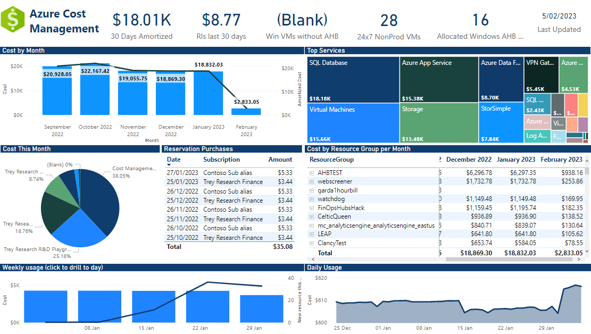
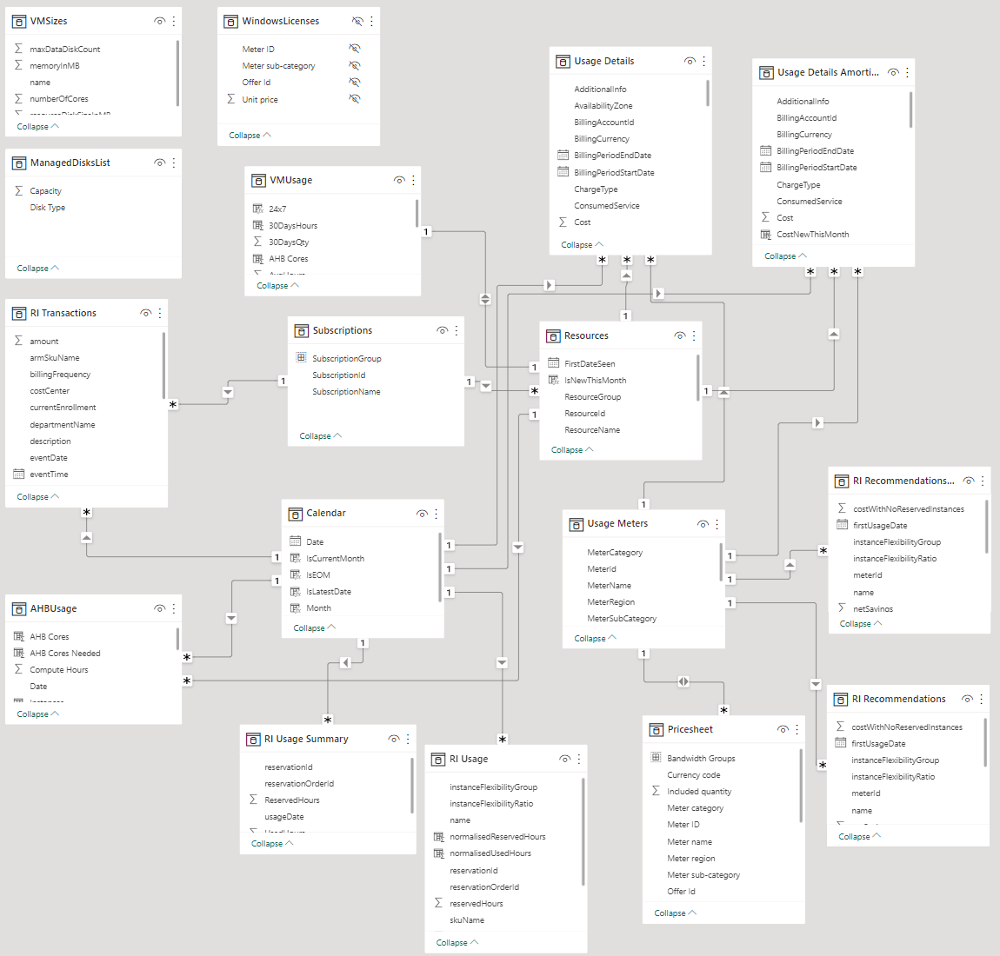
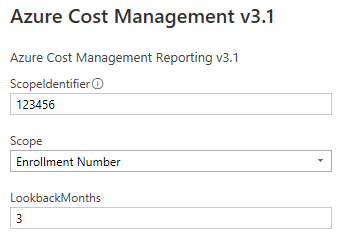

# Azure Cost Management Power BI Report

This report has been developed over a number of years as a starting point for building Azure Cost reporting using the [Azure Cost Management Connector](https://learn.microsoft.com/en-us/power-bi/connect-data/desktop-connect-azure-cost-management). This is something I have created in my spare time to help customers visualise Azure costs.

## Report Pages
**Summary Tab**: This page shows an overview of enrolment costs, by month and subscription, as well as a daily trend. Costs are further broken down by resource group. Across the top are the totals for the selected time period (with exception for the last 30 days cost). Details can be found in subsequent pages.

**New Deployments Tab**: This shows deployments made in the past month (Resource IDs not seen in the past 30 days) to help understand what is new in your environment.

**Marketplace Usage Tab**: This shows any recent Azure Marketplace usage.

**Cost Allocations Tab**: This page shows an overview of costs, by specific tags, as well as top 10. 

**Hybrid Benefit Tabs**: This tab aims to show approximate utilisation of [Azure Hybrid Benefit](https://docs.microsoft.com/en-us/windows-server/get-started/azure-hybrid-benefit ). It introduces a metric 'AHBCores' which represents the number of cores of Windows Server license + SA  will be required to cover a VM on Azure (a minimum of 8 cores - so 1, 2 and 4 core VMs will require 8). 

As the granularity of the data is daily, the number of cores here are approximate - it is assumed if a VM ran using AHB during the day, then it will count for the whole day.

**Reserved Instances Tab**: This tab shows any Reservations purchased recently, and their approximate utilisation. For more accurate utilisation numbers, refer to the Azure Portal Reservations blade.

It also shows reserved instances recommendations based on the RI Recommendations API. They are based off the past 30 days usage, and 1-year RI terms are shown (to reveal 3-year RI terms, change the visualisation filters)

**Non-Prod 24x7 VMs Tab**: This tab shows VMs that have been running >700 hours in the past 30 days, from non production subscriptions.

**Logging Tab**: This shows Azure Monitor trends over the past 30 days.

**Storage Tab**: This tab shows actual costs for storage over the past 30 days, and shows an approximate trend for total storage capacity (this is based off actual paid & provisioned storage usage, in storage accounts, CosmosDB, Backup, etc)

**Network Tab**: This tab shows actual costs for network over the past 30 days, and shows an approximate trend for total bandwidth in/out.

**Compute Tab**: This tab shows compute trends over the past 30 days.

## Data Model
Most of the tables in the Power BI connector are included, although to reduce data size, some large text columns have been excluded (these can be seen in the Power Query Editor).
Two static tables have been added for VM size and Managed Disk capacity (future scope to move these to API calls to auto-refresh)

## Deploying the report
### Prerequisites
- Enterprise Reader role in your Enterprise Enrollment
- [Power BI Desktop](https://aka.ms/pbidesktopstore) installed

### Loading the data
- Open the [Power BI template](./Azure%20Cost%20Management.pbit) in Power BI Desktop
- When prompted for parameters, enter your Enrollment number (can be found in the Billing Account blade in the [Azure Portal](https://portal.azure.com)), how many months of data to load, and your Azure subscription offer (MS-AZR-0017P is the default Enterprise Agreement offer)

- Enjoy!
- If you have Power BI service and licensing, you can also publish to a workspace and set up a recurring refresh schedule.

---
*THE SOFTWARE IS PROVIDED "AS IS", WITHOUT WARRANTY OF ANY KIND, EXPRESS OR IMPLIED, INCLUDING BUT NOT LIMITED TO THE WARRANTIES OF MERCHANTABILITY, FITNESS FOR A PARTICULAR PURPOSE AND NONINFRINGEMENT. IN NO EVENT SHALL THE AUTHORS OR COPYRIGHT HOLDERS BE LIABLE FOR ANY CLAIM, DAMAGES OR OTHER LIABILITY, WHETHER IN AN ACTION OF CONTRACT, TORT OR OTHERWISE, ARISING FROM, OUT OF OR IN CONNECTION WITH THE SOFTWARE OR THE USE OR OTHER DEALINGS IN THE SOFTWARE*

*We grant You a nonexclusive, royalty-free right to use and modify the Sample Report and to reproduce and distribute the object code form of the Sample Report, provided that You agree:*

*(i) to not use Our name, logo, or trademarks to market Your report in which the Sample Report is used;*

*(ii) to include a valid copyright notice on Your report in which the Sample Report is used;*

*and (iii) to indemnify, hold harmless, and defend Us and Our suppliers from and against any claims or lawsuits, including attorneys’ fees, that arise or result from the use or distribution of the Sample Report.*